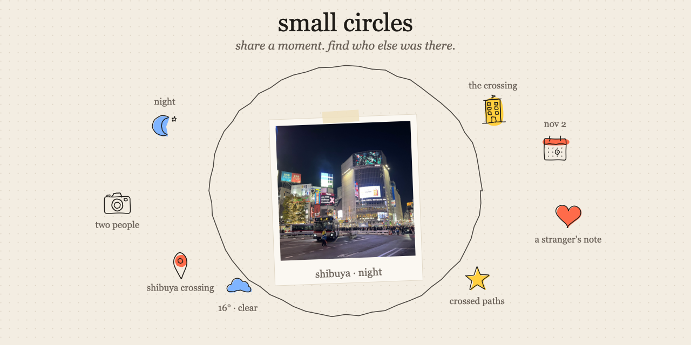
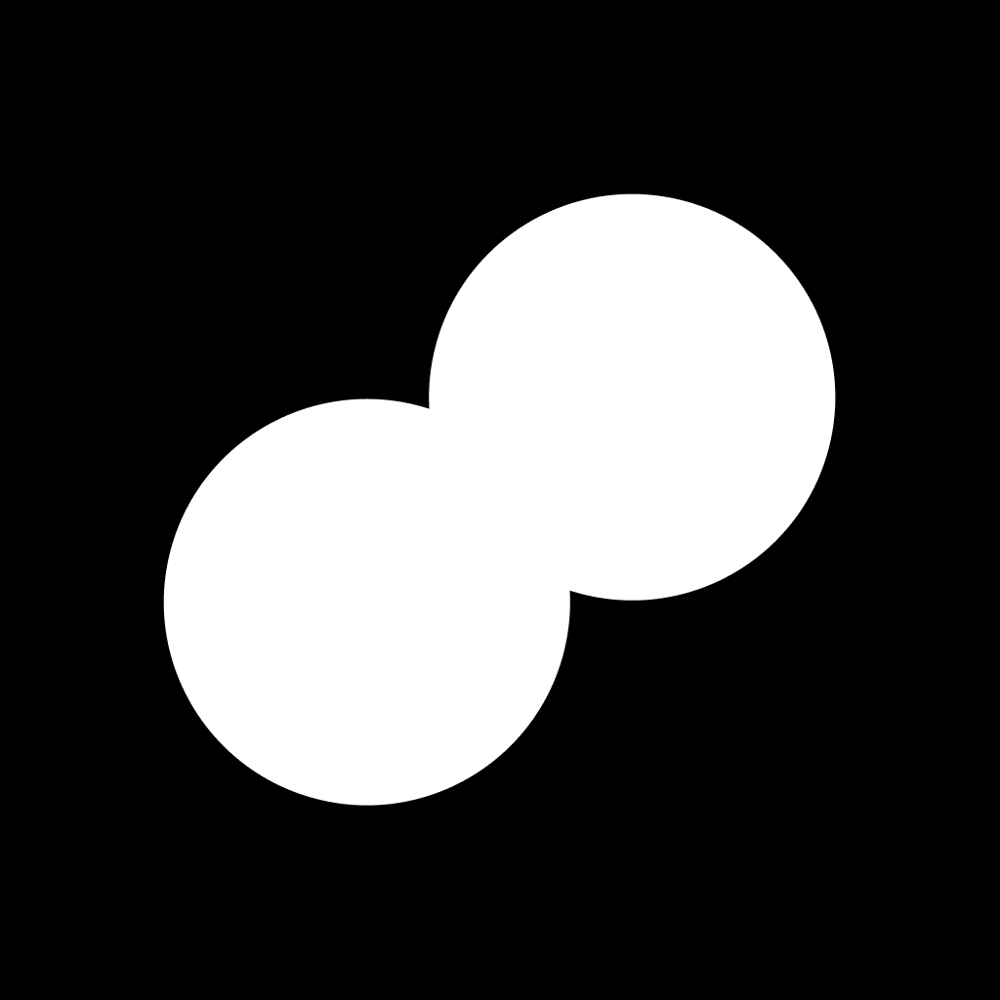

<div align="center">
  <a href="https://successful-antelope-571.convex.site">
    
  </a>
</div>

<div align="center">

**An open-source app that finds the moments strangers share.**


[**Live app**](https://successful-antelope-571.convex.site) &nbsp;&middot;&nbsp; [How it works](HOW-IT-WORKS.md) &nbsp;&middot;&nbsp; [Design system](DESIGN.md) &nbsp;&middot;&nbsp; [What and why](ABOUT.md) &nbsp;&middot;&nbsp; [Build log](hackathon.md) &nbsp;&middot;&nbsp; [Follow on X](https://x.com/saivion)

</div>

<br />

We're more connected than ever, yet our experiences are increasingly separate. We pass through the same places, live the same moments and share more than we realise, but those overlaps disappear with us. Small Circles surfaces them.

Every hour there's one prompt for everyone. You answer with a photo, and the app works out where and when it was and what was around you, then draws that world around the photo by hand while you watch. Strangers add to it. Behind every circle is an agent that looks for where it overlaps with someone else's moment, the same street corner or the same night, and tells both people. Nothing here is an AI image: every line comes from our own renderer.

Built for the [Convex All Gas No Brakes hackathon](https://www.convex.dev/hackathons/all-gas).

## What we built

- **An hourly shared topic.** One prompt for everyone, changing on the hour (UTC), with a countdown and everyone's answers drifting around it. No accounts: each browser is someone with a two-word name.
- **A drawing pipeline.** A photo becomes a circle: the camera's metadata becomes a place and a date, vision names what's in it, the weather and light are looked up, and 5 to 8 labelled doodles are drawn around a taped instant print. The page draws itself as each thing is found, margin notes and all.
- **Our own illustration renderer.** 66 hand-drawn concepts, a seeded wobbly pen, marker fills printed slightly out of register. The same circle always redraws identically, and no two circles look alike. See every drawing at `?sheet=1`.
- **Give to get.** Your moment goes out once you've visited three of other people's. Discover shows three at a time, the ones the fewest people have seen. No feed, no likes, no followers.
- **A circle that grows.** Anyone can add a reaction, a note, a memory or a photo. Each addition is read first (it picks the drawing, writes the label and turns away anything unkind) and lands on the circle's outer ring, placed so it never covers what's already drawn.
- **The Circle Agent.** Event-driven, never on a loop. It matches moments on structured context, connects the strong ones, and passes every would-be email through a meaning gate whose default answer is to do nothing.
- **Email as the way back in.** When the agent does write, that email's thread is the circle's address. Reply with a memory or a photo and it joins the circle. GPS is stripped from replied photos before anyone sees them.
- **Starter moments.** 14 public-domain and Creative Commons photos, drawn by the same pipeline and labelled as starters, so a quiet hour is never empty.

## How it's built

| Piece | Where |
| --- | --- |
| Illustration vocabulary: 66 concepts, shared by the model and the renderer | `convex/lib/vocabulary.ts` |
| The pen: seeded, wobbly, hand-drawn SVG strokes | `src/lib/doodle/pen.ts` |
| The drawings, one per concept | `src/lib/doodle/primitives.ts` |
| Composition: ring, print, slots, sizes, arrows, palette, all from the seed | `src/lib/doodle/compose.ts` |
| The outer ring: what people added, placed clear of the drawing | `composeOuter` in `src/lib/doodle/compose.ts` |
| The page drawing itself on (`pathLength` + dash animation) | `src/components/circles/` |
| The four drawing agents: Visual, Context, Discovery, Curator | `convex/moments/draw.ts` |
| Place, weather, sun and light from metadata | `convex/moments/world.ts` |
| The Circle Agent: events, matching, the meaning gate, emails | `convex/agent/`, `convex/lib/match.ts` |
| Replies to the agent's emails, added to the circle | `convex/moments/inbox.ts` |
| The hour: prompts and the clock, shared by page and backend | `convex/lib/hour.ts` |
| The pool, discover (least-seen first), views, give-to-get | `convex/circles.ts` |
| Contributions, and Small Circles reading them | `convex/contributions.ts`, `convex/moments/contribute.ts` |
| Names, who's here | `convex/lib/names.ts`, `convex/people.ts` |
| GPS stripped from photos that arrive by email | `convex/lib/stripGps.ts` |
| Starter moments, and the photos they're drawn from | `convex/seed.ts`, `public/samples/` |

### Convex

Convex is the whole backend. There is no other server.

- **Reactive queries.** A circle is a live query. Each element appears the moment the pipeline adds it, the margin notes write themselves from `circleNotes` rows, and a stranger's note lands on your circle while you're looking at it. The hour's ring, "who's here" and your `+2` badges are live too. Nothing polls.
- **One shared database for everyone.** Views count people, not visits (one `circleViews` row per person per circle). Give-to-get is paid down inside the same mutation that records a visit, so it can't drift.
- **Mutations with validators on everything.** Every element passes one `addElement` gate: a real vocabulary id, at most 8 per circle, no duplicate drawings or repeated names.
- **File storage.** Photos upload from the browser straight to storage; a photo someone replies with by email is stored from an action.
- **Actions (Node).** The drawing pipeline, the agent and the inbox.
- **Scheduler.** Creating a circle schedules its drawing. The webhook schedules the inbox work so it can answer at once. A finished, featured circle and every settled contribution wake the Circle Agent.
- **Crons.** A sweep closes any circle whose drawing stopped, keeping what was found. Presence and webhook idempotency rows are pruned.
- **HTTP actions.** The AgentMail webhook, Svix-signed and verified in Convex.
- **Components.** `@convex-dev/static-hosting` serves the app at `convex.site`, next to the webhook route.

### OpenAI (`gpt-5-mini`, minimal reasoning)

- **Visual agent.** Looks at the photo: names the moment, says what kind it is, writes a margin note of what it noticed first, and picks the things to draw, each mapped to a drawing that genuinely depicts it and where it sits in the frame (for the arrows).
- **A second look.** If a circle comes out thin (a photo with no location or date can), it looks again for what the first pass walked past, so no moment finishes with a bare ring.
- **Curator agent.** Writes the final title and subtitle, an explore note for each element grounded in what was found, and adds at most two discovered things that a source supports.
- **Contribution reader.** Every note, memory or photo someone adds is read before it lands: it picks the doodle, writes a short label, and turns away anything cruel, sexual, spammy or that shares private details.
- **The meaning gate.** Decides whether anything is worth emailing a person about.

The model never positions or styles anything. It returns words, a vocabulary id and an importance; the renderer does the rest.

### Firecrawl

The **Discovery agent** searches for the named things a moment contains (the landmark, the venue, the neighbourhood) and hands the results to the Curator. Sources become explore notes and linked references on the doodles, never a list of search results.

### AgentMail

AgentMail is how Small Circles reaches people, and only when it has something worth saying. Circles are made on the page, never by email.

- The agent writes when a moment crossed paths with someone else's, or when people added real words or photos to it.
- Each email is answerable: its thread is that circle's address. A reply (a memory, a note, a link, a correction, a photo) is read and added. Anything else sent to the inbox is ignored, and no email is ever answered with an email.
- A photo in a reply comes straight off a phone with GPS inside; the location is stripped before anyone else can see it.

### The Circle Agent

Every circle has an agent whose one job is to make that circle more meaningful. An event wakes it, it looks, and it decides. **Doing nothing is the default and the most common outcome.**

| It wakes when | It may |
| --- | --- |
| a circle is drawn and featured | look for other people's moments it crossed paths with, and connect them |
| someone adds to a circle (on the page or by email) | wait three minutes, so several additions become one decision |
| that batch window closes | tell the owner their moment grew, if what was added is worth it |
| a circle is redrawn | look again, quietly |

**Finding connections** (`convex/lib/match.ts`). Moments are compared on structured context, never on words alone:

| Signal | Weight |
| --- | --- |
| the same exact place (both photos' GPS within ~120 m, or the same named spot) | +0.50 |
| the same landmark, or the same source drawn around both | +0.25 |
| nearby (GPS within ~1 km) | +0.15 |
| the same neighbourhood · the same city | +0.10 · +0.05 |
| the same day · within two weeks | +0.10 · +0.05 |
| the same kind of moment, the same things in it | up to +0.10 |

Only a total of **0.5 or more** is ever considered, so two dinners in the same city on the same day (about 0.2) are left alone. Distances only use the photos' own GPS: a place guessed from the picture never counts as exact. Starter moments and your own moments are never connected.

**The meaning gate** (`convex/agent/run.ts`). Before anything leaves the circle, hard rules run first and can only say no (a real person, an address, not us, not already sent, not more than five emails a day). Then the model answers: *why does this matter, who benefits, what changes, and does it need an email, or can the circle just show it?* If it can't be asked, the answer is no email. Every email is checked for anything that sounds like a bot talking about itself before it's sent.

**Loop safety.** Events are idempotent by key and processed once. Events the agent causes are one level deeper, and nothing goes deeper than two. Connections are unique per pair. Notifications are unique per key, and that key is AgentMail's idempotency key, so even a retried send can't go out twice.

### Also used

- [OpenStreetMap Nominatim](https://nominatim.org) turns coordinates into a neighbourhood, city or named spot, and a recognised landmark back into coordinates.
- [Open-Meteo](https://open-meteo.com) provides historical weather and sunrise and sunset, which is how 8:32pm becomes *just before sunset*.
- `exifr` reads the camera's metadata in the browser, before the photo is resized.

## Running locally

```bash
git clone https://github.com/Saivion/SmallCircles.git
cd SmallCircles
npm install
npx convex dev          # first run creates the deployment and writes .env.local
```

In a second terminal:

```bash
npm run dev
```

Node 22 is what this was built on. Keys live on the Convex deployment, never in the browser or this repo; [.env.production](.env.production) lists every variable as a `${...}` placeholder.

```bash
npx convex env set OPENAI_API_KEY sk-...
npx convex env set FIRECRAWL_API_KEY fc-...
npx convex env set AGENTMAIL_API_KEY ...
npx convex env set MOMENTS_INBOX_ADDRESS you@agentmail.to
npx convex env set SITE_URL https://<deployment>.convex.site
```

| Path | Purpose |
| --- | --- |
| `convex/` | **The whole backend.** Queries, mutations, actions, crons, the HTTP webhook and the schema. |
| `convex/agent/` | The Circle Agent: events, candidates, connections, the meaning gate and its emails. |
| `convex/moments/` | The drawing pipeline, the world lookups, contributions and email replies. |
| `convex/lib/` | Shared with the client: the vocabulary, the hour's prompts, matching, names, EXIF. |
| `src/lib/doodle/` | The renderer: the pen, one drawing per concept, and the composition. |
| `src/components/circles/` | The app: the hour, a circle, discover, the way in, contributing. |
| `public/samples/` | Starter photos, with credits in `CREDITS.md`. |

Useful checks:

```bash
npm run typecheck
npm run lint
npx convex run agent/store:recent   # every decision the agent made, including the nothings
```

<details>
<summary><b>Deploying and operating</b> (maintainers)</summary>

<br />

Share the starter moments once per deployment, so a quiet hour is never empty: the photos in `public/samples` are posted through the same public path a person uses (upload, then `circles:create`, as the house workspace), so the real pipeline draws them.

Point AgentMail at the webhook once, and store its signing secret:

```bash
npx convex run agentmail:registerWebhook '{"url":"https://<deployment>.convex.site/agentmail/webhook"}'
npx convex env set AGENTMAIL_WEBHOOK_SECRET whsec_...
```

Then deploy. This builds the static export against production, pushes the backend (Convex asks you to confirm) and uploads the site: one URL for the app, its API and the webhook.

```bash
npm run deploy
```

For production, set the same environment variables with `--prod`, register the webhook with the production URL, and share the starter moments against the production deployment.

The cover image at the top of this file is drawn by the app's own pen and renderer, from the same vocabulary the app uses.

</details>

## Limits

- Between 5 and 8 things around a moment (a thin circle gets a second look), 2 arrows and 3 marker colours ([DESIGN.md](DESIGN.md) §10). What people add sits on a separate outer ring: the newest 12 are drawn.
- 20 new circles an hour per person, and photos up to 15 MB. Uploads are resized to 2048px in the browser, which also drops their metadata.
- Up to 3 additions per person per circle, and 30 an hour.
- At most five emails a day to one person, and never one per reaction.
- No sign-up. Each browser is someone, with an unguessable key and a two-word name; knowing the link is being that person.

## Contributing

Issues and pull requests are welcome: new drawings for the vocabulary, better prompts for the hour, matching signals, accessibility fixes. Run `npm run typecheck` and `npm run lint` before opening one, and keep [DESIGN.md](DESIGN.md) true: the renderer decides how things look, never the model.

## License

[MIT](LICENSE). Use it, fork it, ship it. The starter photos in `public/samples` are public domain or Creative Commons and carry their own credits in [CREDITS.md](public/samples/CREDITS.md).

<div align="center">
  <br />
  
  <p><sub>Built by <a href="https://x.com/saivion">@Saivion</a></sub></p>
</div>
